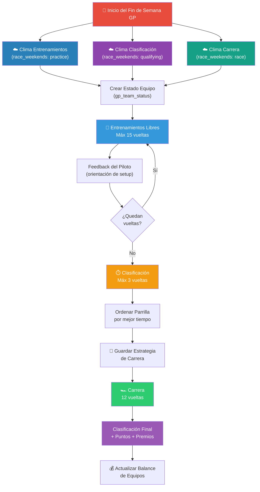
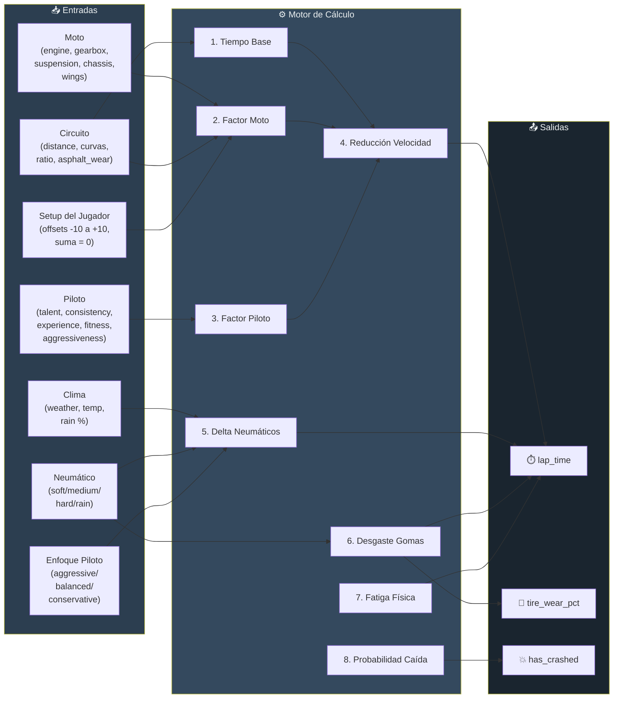
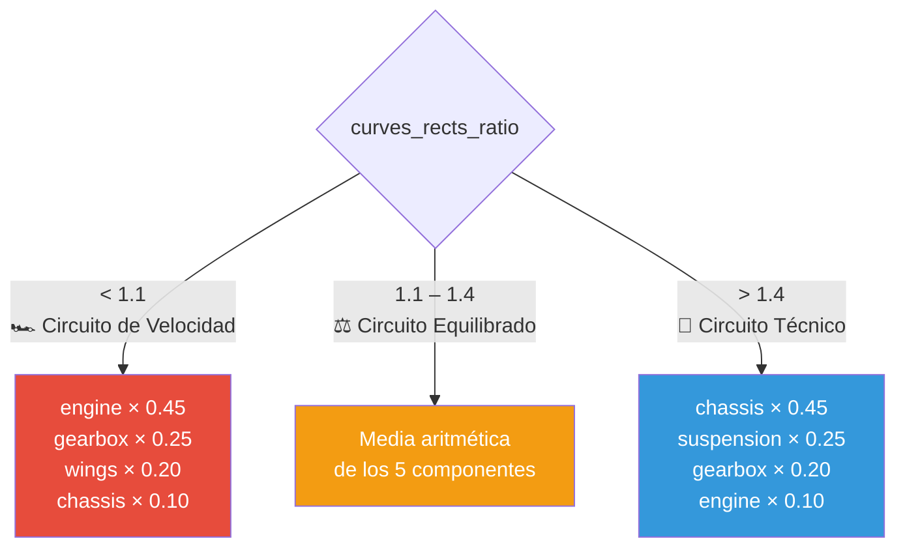
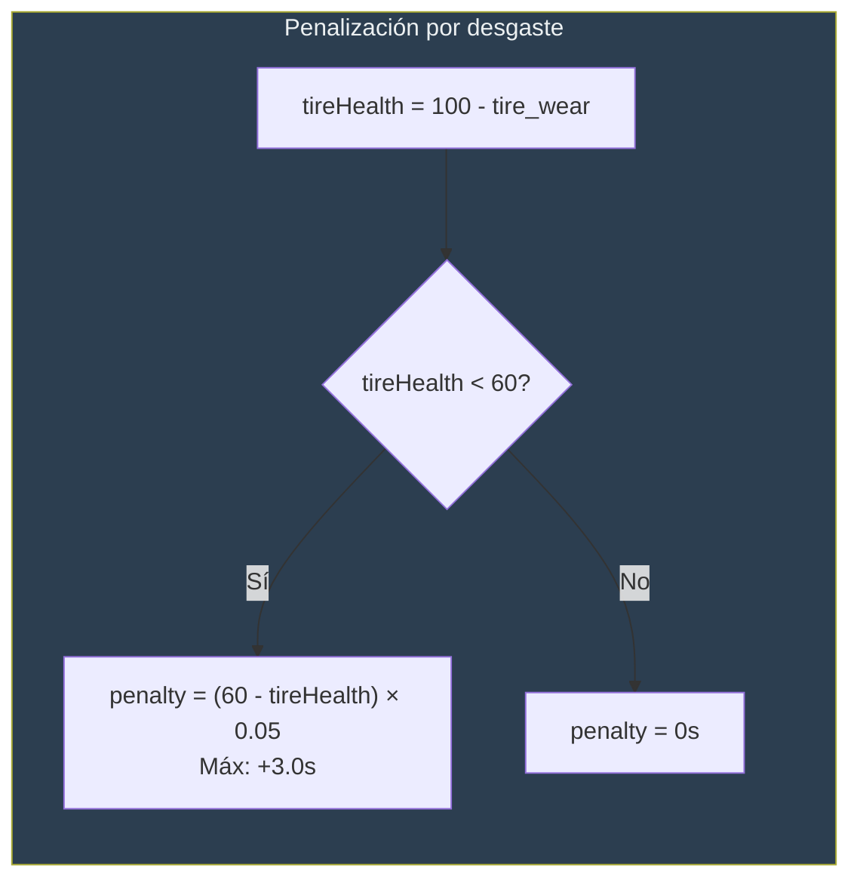
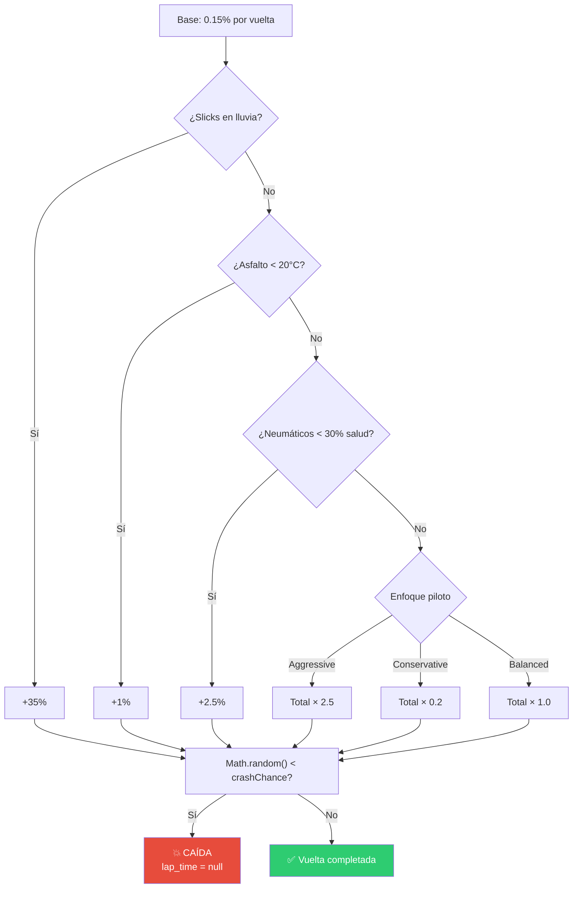
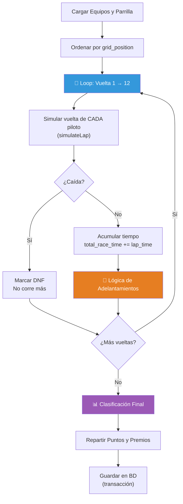
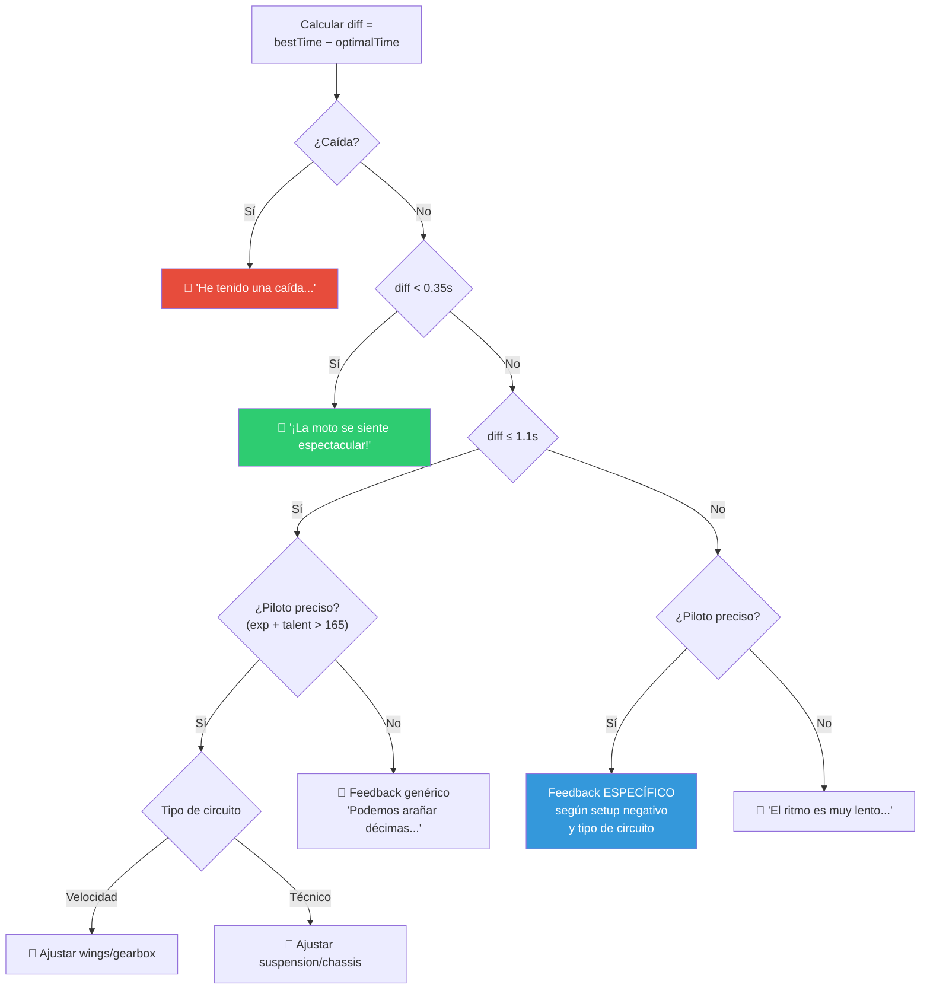
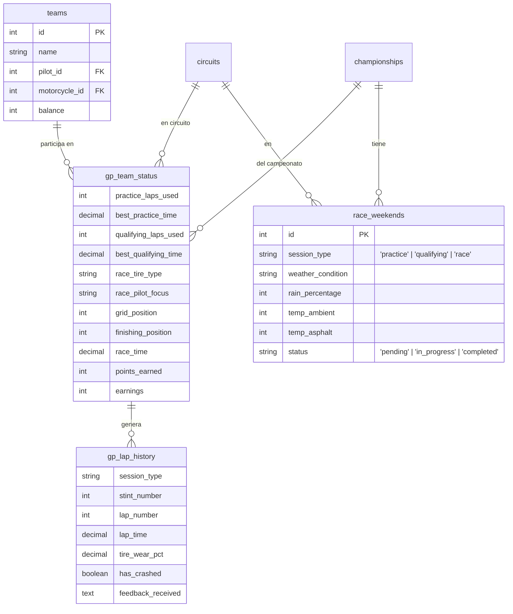

# Motor de Simulación de Carreras

> Documentación técnica del motor de simulación de Gran Premio de MotoGP Manager.
> 
> **Archivos clave:**
> - [`backend/controllers/simulation.controller.js`](../backend/controllers/simulation.controller.js) — Endpoints HTTP y validación de requests
> - [`backend/services/simulation.service.js`](../backend/services/simulation.service.js) — Capa de servicio y coordinación
> - [`backend/services/simulation.engine.js`](../backend/services/simulation.engine.js) — Motor puro de cálculo físico
> - [`backend/models/simulation.model.js`](../backend/models/simulation.model.js) — Modelo de datos y queries
> - [`backend/utils/scheduler.js`](../backend/utils/scheduler.js) — Simulación automática de carreras
> - [`backend/migrations/`](../backend/migrations/) — Archivos de migración de base de datos (`node-pg-migrate`)

---

## Visión General

El sistema de simulación implementa un **Gran Premio completo de MotoGP** con tres sesiones diferenciadas: Entrenamientos Libres, Clasificación y Carrera. Cada sesión utiliza el mismo motor de simulación vuelta a vuelta (`simulateLap()`), pero con reglas y restricciones distintas.

---

## Arquitectura del Flujo Completo del GP



---

## 1. Generación del Clima

Definida en [`getOrCreateWeekend(championshipId, circuitId, sessionType)`](../backend/models/simulation.model.js).

El clima se genera **de forma independiente para cada sesión** del GP. Esto significa que puede llover en clasificación pero lucir el sol en carrera. La función recibe el `session_type` como tercer parámetro y la clave única en BD es `(championship_id, circuit_id, session_type)`.

El endpoint `getGPStatus` obtiene los 3 climas al cargar el Race Center y los devuelve agrupados:
```json
{
  "weather": {
    "practice":   { "weather_condition": "sunny", "temp_ambient": 28, ... },
    "qualifying": { "weather_condition": "rainy", "rain_percentage": 65, ... },
    "race":       { "weather_condition": "cloudy", "temp_ambient": 22, ... }
  }
}
```

| Condición | Probabilidad | Temp. Ambiente | Temp. Asfalto | Lluvia (%) |
|-----------|:------------:|:--------------:|:-------------:|:----------:|
| ☀️ Soleado | 50% | 18–35 °C | Ambiente + 10 | 0% |
| ☁️ Nublado | 30% | 18–35 °C | Ambiente + 2 | 0% |
| 🌧️ Lluvioso | 20% | 12–22 °C | Ambiente − 2 | 30–100% |

> **Nota:** Cada sesión tira sus propios dados de clima de forma independiente. El clima de entrenamientos **no influye** en el de carrera.

---

## 2. Motor de Simulación: `simulateLap()`

Este es el **núcleo matemático** del sistema, ubicado en [`simulation.engine.js`](../backend/services/simulation.engine.js). Calcula el tiempo de cada vuelta individual considerando 7 factores.



### 2.1. Tiempo Base del Circuito

```
baseLapTime = (circuit.distance × 0.0215) + (curvas_derecha + curvas_izquierda) × 0.15
```

Ejemplo para Jerez (4423m, 8 curvas derecha, 5 izquierda):

```
T_base = (4423 × 0.0215) + (8 + 5) × 0.15 = 95.09 + 1.95 = 97.04s
```

### 2.2. Factor de Rendimiento de la Moto

El circuito determina qué componentes de la moto importan más, usando el **ratio curvas/rectas** (`curves_rects_ratio`):



> **⚠️ Importante:** Los valores de la moto se **suman con los offsets del setup** del jugador antes de calcular el factor. Ejemplo: `engineEff = bike.engine + setup.setup_engine`. Esto permite al jugador redistribuir puntos (suma = 0) para optimizar según el tipo de circuito.

### 2.3. Factor del Piloto

```
pilotFactor = (talent × 0.4) + (consistency × 0.2) + (experience × 0.2) + (fitness × 0.2)
```

El **talento** pesa el doble que el resto de atributos.

### 2.4. Reducción de Velocidad

Combina piloto y moto al 50/50 para reducir el tiempo base:

```
speedReduction = ((pilotFactor × 0.5) + (bikeFactor × 0.5)) × 0.05
```

> **💡 Tip:** Con un piloto perfecto (100 en todo) y moto perfecta (100 + setup 10), la reducción máxima sería: `((100 × 0.5) + (110 × 0.5)) × 0.05 = 5.25s`

### 2.5. Neumáticos y Climatología

#### Tabla de rendimiento por neumático y condición:

| Neumático | Seco: Delta Tiempo | Seco: Factor Desgaste | Lluvia: Delta Tiempo | Lluvia: Factor Desgaste |
|-----------|:------------------:|:---------------------:|:--------------------:|:-----------------------:|
| 🔴 Soft | −0.35s (rápido) | ×1.6 | — | — |
| 🟡 Medium | 0.0s | ×1.0 | — | — |
| ⚪ Hard | +0.3s (lento) | ×0.65 | — | — |
| 🔵 Rain | +5.5s | ×3.5 ☠️ | +4.0s | ×0.7 |
| Slicks en lluvia | — | — | +13.0s | ×0.5 |

> **🚨 Precaución:** Usar **slicks en lluvia** añade un **+35% de probabilidad de caída** por vuelta. Usar **neumáticos rain en seco** destruye las gomas (factor ×3.5).

#### Modificadores adicionales de clima:
- **Asfalto > 40°C + soft**: desgaste ×1.35 extra
- **Asfalto < 20°C** (sin lluvia): +1% probabilidad de caída (gomas frías)

### 2.6. Enfoque del Piloto

| Enfoque | Delta Tiempo | Desgaste | Probabilidad Caída |
|---------|:----------:|:--------:|:------------------:|
| 🔥 Aggressive | −0.25s | ×1.45 | ×2.5 |
| ⚖️ Balanced | 0.0s | ×1.0 | ×1.0 |
| 🛡️ Conservative | +0.25s | ×0.6 | ×0.2 |

### 2.7. Cálculo del Desgaste de Neumáticos

```
baseTireWear = { soft: 3.8, medium: 2.5, hard: 1.6, rain: 2.2 }

currentLapWear = baseTireWear 
    × (1 + asphalt_wear / 150) 
    × wearFactor 
    × (1 + (aggressiveness - experience / 2) / 200)

newTireWear = min(100, accumulatedWear + currentLapWear)
```



### 2.8. Fatiga Física del Piloto

```
fatigueStartLap = totalLaps × (0.4 + fitness / 200)
if (lapNum > fatigueStartLap):
    fatiguePenalty = (lapNum - fatigueStartLap) × 0.04
    if (temp_ambient > 32°C):
        fatiguePenalty × 1.35
```

> **📝 Nota:** Un piloto con **fitness = 100** empieza a fatigarse en la vuelta 90% del total. Uno con **fitness = 0**, en la vuelta 40%.

### 2.9. Probabilidad de Caída



### 2.10. Fórmula Final del Tiempo de Vuelta

```
T_vuelta = T_base - speedReduction + Δ_neumático + Δ_enfoque + penalty_desgaste + penalty_fatiga + noise
```

Donde `noise = random(0, 0.3)` introduce variabilidad natural.

---

## 3. Sesiones del Gran Premio

### 3.1. Entrenamientos Libres

**Endpoint HTTP:** `runPracticeStint()` en [`simulation.controller.js`](../backend/controllers/simulation.controller.js)
**Lógica de Negocio:** `runStint()` en [`simulation.service.js`](../backend/services/simulation.service.js)

| Parámetro | Valor |
|-----------|-------|
| Vueltas máximas | **15** (repartidas en múltiples stints) |
| Horario | 12:00h – 15:00h |
| Objetivo | Probar setups y recibir feedback del piloto |

**Flujo:**
1. El jugador elige: neumático, enfoque, setup (5 offsets que suman 0)
2. Se simulan N vueltas (sin exceder el límite)
3. Se registra la mejor vuelta del stint
4. Se genera **feedback** comparando con el tiempo óptimo teórico

### 3.2. Clasificación

**Endpoint HTTP:** `runQualifyingStint()` en [`simulation.controller.js`](../backend/controllers/simulation.controller.js)
**Lógica de Negocio:** `runStint()` en [`simulation.service.js`](../backend/services/simulation.service.js)

| Parámetro | Valor |
|-----------|-------|
| Vueltas máximas | **3** |
| Horario | 12:00h – 15:00h |
| Objetivo | Establecer posición de parrilla |

**Después de clasificar:**
- Se obtienen todos los equipos del GP
- Se ordenan por `best_qualifying_time` (menor es mejor)
- Se asigna `grid_position` a cada uno

### 3.3. Carrera

**Endpoint HTTP:** `runRaceSimulation()` en [`simulation.controller.js`](../backend/controllers/simulation.controller.js)
**Lógica de Negocio:** `runRaceInternal()` en [`simulation.service.js`](../backend/services/simulation.service.js)

| Parámetro | Valor |
|-----------|-------|
| Vueltas | **12** |
| Horario | A partir de las 14:00h |
| Participantes | **Todos los equipos** (incluidos los controlados por IA) |



#### Lógica de Adelantamientos

Ocurre **después de simular la vuelta de todos**:

1. Se filtran pilotos activos y se ordenan por `total_race_time`
2. Para cada par adyacente, si el gap < **0.4 segundos**:

```
pOvertake = 0.35 
    + (talentA − talentB) × 0.003
    + (aggressivenessA − consistencyB) × 0.004
    + (experienceA − experienceB) × 0.003
    + (setupEngineA − setupEngineB) × 0.002
    + (si aggressive: +0.15)
```

Si `Math.random() < pOvertake`:
- El adelantador: `total_race_time -= 0.1`, `tire_wear += 1.5`
- El adelantado: `total_race_time += 0.3`

#### Puntos y Premios

| Posición | Puntos | Premio (€) |
|:--------:|:------:|:----------:|
| 🥇 1° | 15 | 150.000 |
| 🥈 2° | 12 | 120.000 |
| 🥉 3° | 10 | 100.000 |
| 4° | 8 | 80.000 |
| 5° | 7 | 70.000 |
| 6° | 6 | 60.000 |
| 7° | 5 | 50.000 |
| 8° | 0 | 40.000 |
| 9° | 0 | 30.000 |
| 10° | 0 | 20.000 |
| DNF | 0 | 10.000 |

---

## 4. Sistema de Feedback

Definido en `generateFeedback()` en [`simulation.engine.js`](../backend/services/simulation.engine.js). Compara la mejor vuelta del stint con el **tiempo óptimo teórico** (setup perfecto +10, neumático blando, piloto agresivo).



> **📝 Nota:** Los pilotos con **(experience + talent) > 165** dan feedback **específico** indicando qué componente del setup ajustar. Los pilotos menos hábiles dan feedback **genérico**.

---

## 5. Simulación Automática (Scheduler)

El [`scheduler.js`](../backend/utils/scheduler.js) ejecuta un chequeo **cada 60 segundos** buscando carreras pendientes. 

Para identificar qué carreras están pendientes de simulación, el scheduler:
1. Consulta el calendario oficial (`championship_circuits`) de los campeonatos activos.
2. Filtra aquellos Grandes Premios donde los equipos aún no tienen resultados de carrera (no existe `finishing_position` en `gp_team_status`).

Para cada carrera pendiente, evalúa la fecha teórica:
- **Condición A**: La fecha de carrera ya pasó (`raceDateStr < today`)
- **Condición B**: Es hoy y ya son las 15:00h o más (dando 1 hora de margen desde las 14:00h)

Si se cumple alguna de estas condiciones, el scheduler ejecuta `runRaceInternal()` de forma completamente automática, procesando la carrera para todos los equipos inscritos, incluso si ningún usuario ha entrado al fin de semana del GP.

> **⚠️ Importante:** La fecha de cada carrera se calcula dinámicamente como: `start_date + (order - 1) × 4 + 2 días`. Es decir, los circuitos se separan 4 días entre sí, y la carrera es siempre el **tercer día** del bloque (offset de 2 días).

---

## 5.1. Restricciones Horarias (`validateSessionTime`)

La función `validateSessionTime` en `simulation.service.js` valida que una sesión se simule en la fecha y hora correcta. Su comportamiento depende del campo `time_restricted` del campeonato:

| `time_restricted` | Practice / Qualifying | Race |
|---|---|---|
| `true` (default) | Solo entre **12:00h y 15:00h** del día de la sesión | Solo a partir de **14:00h** del día de carrera |
| `false` | Sin restricción de hora (cualquier momento del día correcto) | Solo a partir de **14:00h** del día de carrera |

> **💡 Nota:** La restricción de la hora de la carrera (≥ 14:00h) aplica siempre, independientemente de `time_restricted`. Solo los entrenamientos y clasificación se ven afectados por el toggle.

El parámetro `bypass = true` (usado por administradores) omite **todas** las validaciones de hora y fecha.

### 5. Carrera y Broadcasting (Live Timing)

El proceso de carrera (endpoint: `/api/simulation/race`) coordina el motor físico con la persistencia y la transmisión en vivo (WebSockets).

**Proceso de Simulación (Live Timing)**
1. **Verificación**: Confirma si la carrera ya se ha corrido y comprueba los equipos participantes.
2. **Cálculo Completo Síncrono**: Se calcula la carrera completa vuelta a vuelta (12 vueltas) instantáneamente, incluyendo desgastes, tiempos, caídas y adelantamientos, y se persiste todo en `gp_lap_history`.
3. **Broadcasting Progresivo**: A través de `socket.service.js`, el backend comienza un bucle que emite el estado de la carrera vuelta a vuelta (`race-lap`) **cada 20 segundos** a los clientes conectados (`room:gp:championshipId:circuitId`). Además, el estado del fin de semana en la base de datos se marca como `in_progress` para que los usuarios que recarguen la página vean correctamente el estado de "En curso" y se unan al Live Timing sin duplicar simulaciones.
4. **Finalización Diferida**: Sólo cuando se termina de emitir la última vuelta (240 segundos después del inicio), se marca el evento como completado en la base de datos (`markWeekendCompleted`) y se emite el evento `race-finished`.

---

## 6. Restricciones del Sistema de Setup

El sistema de **setup de la moto** funciona como un juego de **suma cero**:

- **5 componentes**: engine, gearbox, suspension, chassis, wings
- **Rango** de cada offset: **-10 a +10**
- **Restricción**: la suma de los 5 offsets debe ser exactamente **0**

Esto obliga al jugador a tomar decisiones estratégicas: mejorar un componente implica empeorar otro.

---

## 7. Modelo de Datos Involucrado


